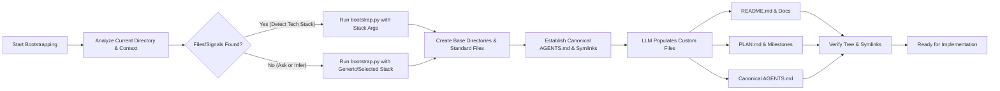

# Bootstrapping Projects

## Overview
Automates the setup of folders, files, planning trackers, version control, and AI guidelines for new or ongoing codebases. This skill uses a combination of a deterministic Python script to create base structures and adaptive LLM logic to write personalized context.

## Bootstrapping Workflow



## Best Practices
- **Clarify Before Action (Ambiguity Gate):** If the tech stack, project scope, database preference, or deployment target is unclear, do not proceed with default assumptions. You must prompt the user with concise options first.
- **Analyze Before Action:** Always inspect the target directory first. Never blindly overwrite existing files. If existing files conflict with bootstrapping templates, ask the user whether to augment, bypass, or replace them.
- **Single Canonical Agent Rules via Symlink (No Duplicate Copies):** Never maintain two separate physical copies of `AGENTS.md` (e.g. root `AGENTS.md` and `.agent/AGENTS.md` or `.agents/AGENTS.md`). Always maintain a single canonical file and link other locations using relative symlinks (e.g., `ln -sf ../AGENTS.md .agents/AGENTS.md` and `ln -sf ../AGENTS.md .agent/AGENTS.md`). This eliminates instruction drift across different agent harnesses (Cursor, Roo Code, Claude Code, Gemini/Jetski).
- **Deduplicate Existing Repositories:** If an existing repository contains duplicate separate files in root `AGENTS.md` and `.agent/AGENTS.md` / `.agents/AGENTS.md`, consolidate all guidelines into the canonical file and replace the duplicate copies with relative symlinks.
- **Relative Symlink Paths:** Always use relative paths when creating symlinks (such as `../AGENTS.md` or `.agents/AGENTS.md`) so that links remain valid across different developer machines, operating systems, and git clones. Never use absolute paths.
- **Combined Bootstrapping:** Use the helper Python script (`scripts/bootstrap.py`) to create empty directories, write boilerplate gitignores, and establish symlinks. Let the LLM fill in high-context files (`PLAN.md`, `README.md`, `AGENTS.md`).
- **Agnostic Agent Rules:** Ensure generated agent instructions (e.g., `AGENTS.md`) are standard and agnostic to specific IDE extensions or agent frameworks.
- **Plan-First Strategy:** Always start with a `PLAN.md` containing verifiable, realistic milestones before writing any application source code.
- **Strict Git Boundaries:** Always initialize a Git repository (`git init`) and a comprehensive `.gitignore` configured specifically for the target stack.

## Process

### 1. Analyze and Infer
1. **Directory Assessment:** Scan the target directory for pre-existing configurations (e.g., `package.json`, `pyproject.toml`, `go.mod`, etc.) or files.
2. **Agent Rules Audit:** Check whether `AGENTS.md`, `.agent/AGENTS.md`, or `.agents/AGENTS.md` already exist:
   - If multiple duplicate physical copies exist, mark them for consolidation and symlink replacement.
   - If a single canonical file exists (e.g., `.agents/AGENTS.md`), retain it as the source of truth and plan symlinks for the other paths.
3. **Ambiguity Assessment:** Evaluate if there is ambiguity regarding the core tech stack/language, frameworks (e.g., React vs. Next.js vs. Vue, or FastAPI vs. Django), or core architectural requirements (e.g., database, auth, hosting).
4. **Active Prompting:** If any of the above are ambiguous or unspecified, prompt the user with concise multiple-choice options before executing file creation.

### 2. Run the Bootstrap Script
Run the automated python script to generate the physical directory tree, default files, and agent rule symlinks:
```bash
python3 skills/bootstrapping-projects/scripts/bootstrap.py --stack [detected-stack]
```
*(Valid stacks: `generic`, `python`, `typescript`, `go`, `rust`)*

The script automatically:
- Creates required project directories (`src`, `docs`, `tests`, `.agents`, `.agent`).
- Creates `.gitignore` tailored to the selected stack.
- Creates placeholders for `README.md` and `PLAN.md`.
- Creates canonical `AGENTS.md` at root and symlinks `.agents/AGENTS.md` and `.agent/AGENTS.md` to `../AGENTS.md`. If duplicates exist, it replaces them with relative symlinks.

### 3. Agent Rules Architecture & Manual Fallback
When bootstrapping manually or verifying the script output, ensure the directory structure matches the canonical symlink layout:

```text
Project Root/
├── AGENTS.md                  <-- Canonical source of truth
├── .agents/
│   └── AGENTS.md              <-- Relative symlink -> ../AGENTS.md
└── .agent/
    └── AGENTS.md              <-- Relative symlink -> ../AGENTS.md
```

If configuring manually via shell commands:
```bash
# 1. Create root AGENTS.md (if not existing)
touch AGENTS.md

# 2. Ensure directories exist
mkdir -p .agents .agent

# 3. Create relative symlinks (replacing duplicates if any)
ln -sf ../AGENTS.md .agents/AGENTS.md
ln -sf ../AGENTS.md .agent/AGENTS.md
```

> [!IMPORTANT]
> Always edit only the canonical file (or follow the symlink). Never write separate, disconnected copies into `.agent/AGENTS.md` or `.agents/AGENTS.md`.

### 4. Customize and Hydrate
The script creates placeholder templates. Customize the primary files with project-specific detail:
1. **README.md:** Formulate a professional overview of the project, including quickstart instructions and architectural layouts.
2. **PLAN.md:** Establish phase-based goals and success criteria for the project's development.
3. **AGENTS.md:** Customize general coding practices, formatting rules, and testing strategies for the selected tech stack in the canonical `AGENTS.md` (all symlinked locations will reflect changes immediately).

### 5. Verification
Confirm that all symlinks and files resolve cleanly:
```bash
git status && ls -la AGENTS.md .agents/AGENTS.md .agent/AGENTS.md
```
Verify that `.agents/AGENTS.md` and `.agent/AGENTS.md` point to `../AGENTS.md` (or the canonical path) and are not duplicate standalone files.

## Common Pitfalls
- **Duplicate Rule Drift:** Creating separate, disconnected physical copies of `AGENTS.md`, `.agent/AGENTS.md`, and `.agents/AGENTS.md`. Always use relative symlinks so that rule updates in one location are immediately reflected across all agent harnesses.
- **Absolute Symlink Paths:** Using absolute paths (e.g. `/Users/.../AGENTS.md`) when creating symlinks, which break upon cloning or moving the repository. Always use relative targets (`../AGENTS.md`).
- **The Guessing Trap:** Proceeding with standard templates or stacks when the user's intent is ambiguous, leading to throwaway work, misconfigured directories, and out-of-sync plans.
- **Overwriting Work:** Destroying existing user code during the setup of a pre-existing directory without asking the user for conflict resolution instructions first.
- **Template Bloat:** Creating folder structures (e.g., deeply nested `domain/application/infrastructure` directories) before a single line of actual feature code is written. Keep it minimal first.
- **Generic Gitignore:** Forgetting to configure stack-specific exclusions, leading to commit pollution (e.g., committing `node_modules` or `.venv`).
