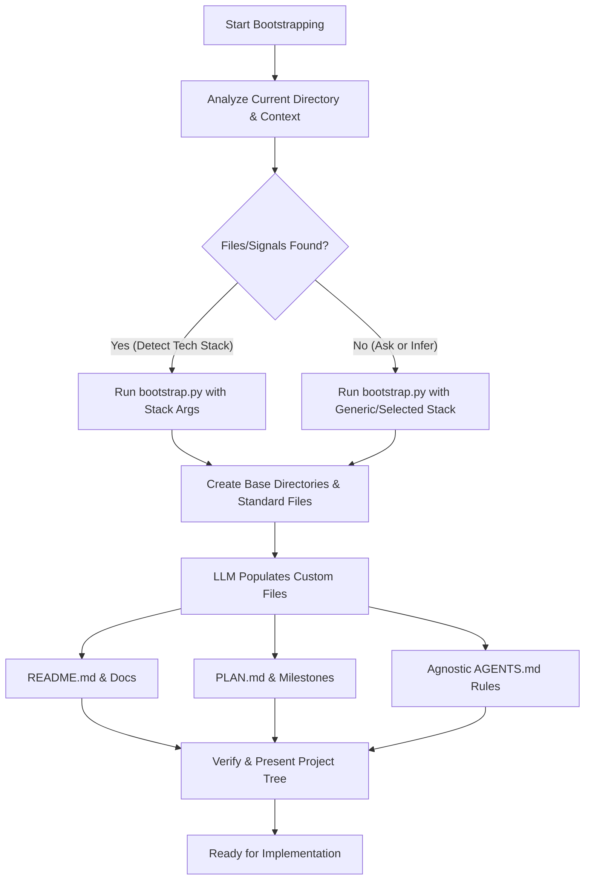

# Bootstrapping Projects

## Overview
Automates the setup of folders, files, planning trackers, version control, and AI guidelines for new or ongoing codebases. This skill uses a combination of a deterministic Python script to create base structures and adaptive LLM logic to write personalized context.

## Bootstrapping Workflow



## Best Practices
- **Clarify Before Action (Ambiguity Gate):** If the tech stack, project scope, database preference, or deployment target is unclear, do not proceed with default assumptions. You must prompt the user with concise options first.
- **Analyze Before Action:** Always inspect the target directory first. Never blindly overwrite existing files. If existing files conflict with bootstrapping templates, ask the user whether to augment, bypass, or replace them.
- **Combined Bootstrapping:** Use the helper Python script (`scripts/bootstrap.py`) to create empty directories and write boilerplate gitignores. Let the LLM fill in high-context files (`PLAN.md`, `README.md`, `AGENTS.md`).
- **Agnostic Agent Rules:** Ensure generated agent instructions (e.g., `AGENTS.md`) are standard and agnostic to specific IDE extensions or agent frameworks (e.g., compatible with Claude Code, Roo, Cursor, Kilo, etc.).
- **Plan-First Strategy:** Always start with a `PLAN.md` containing verifiable, realistic milestones before writing any application source code.
- **Strict Git Boundaries:** Always initialize a Git repository (`git init`) and a comprehensive `.gitignore` configured specifically for the target stack.

## Process

### 1. Analyze and Infer
1. **Directory Assessment:** Scan the target directory for pre-existing configurations (e.g., `package.json`, `pyproject.toml`, `go.mod`, etc.) or files.
2. **Ambiguity Assessment:** Evaluate if there is ambiguity regarding the core tech stack/language, frameworks (e.g., React vs. Next.js vs. Vue, or FastAPI vs. Django), or core architectural requirements (e.g., database, auth, hosting).
3. **Active Prompting:** If any of the above are ambiguous or unspecified, you must use the questioning tool or prompt the user with highly specific, concise multiple-choice options before executing any scripting or file creation.

### 2. Run the Bootstrap Script
Run the automated python script to generate the physical directory tree and default files:
```bash
python3 skills/bootstrapping-projects/scripts/bootstrap.py --stack [detected-stack]
```
*(Valid stacks: `generic`, `python`, `typescript`, `go`, `rust`)*

### 3. Customize and Hydrate
The script creates placeholder templates. Your job as the LLM is to overwrite them with project-specific detail:
1. **README.md:** Formulate a professional overview of the project, including quickstart instructions and architectural layouts.
2. **PLAN.md:** Establish phase-based goals and success criteria for the project's development.
3. **AGENTS.md:** Customize general coding practices, formatting rules, and testing strategies for the selected tech stack.

### 4. Verification
Run a directory tree listing (excluding node_modules/venv/etc.) to confirm structure matches expectation:
```bash
git status && ls -la
```

## Common Pitfalls
- **The Guessing Trap:** Proceeding with standard templates or stacks when the user's intent is ambiguous, leading to throwaway work, misconfigured directories, and out-of-sync plans.
- **Overwriting Work:** Destroying existing user code during the setup of a pre-existing directory without asking the user for conflict resolution instructions first.
- **Template Bloat:** Creating folder structures (e.g., deeply nested `domain/application/infrastructure` directories) before a single line of actual feature code is written. Keep it minimal first.
- **Generic Gitignore:** Forgetting to configure stack-specific exclusions, leading to commit pollution (e.g., committing `node_modules` or `.venv`).
