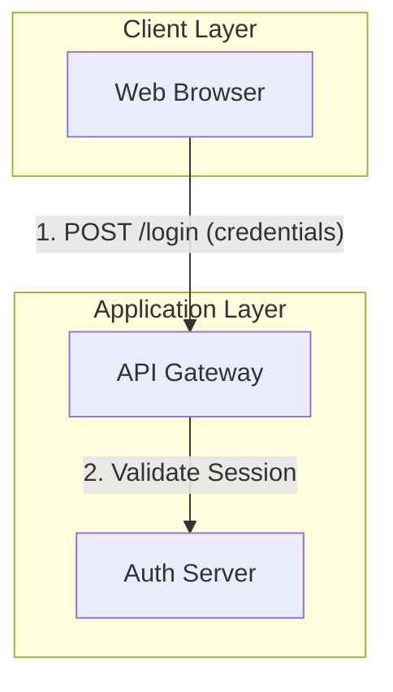
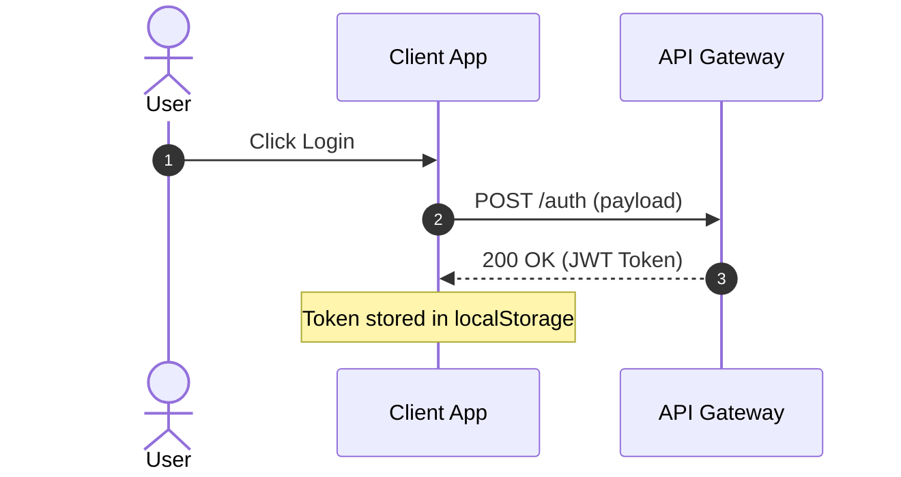
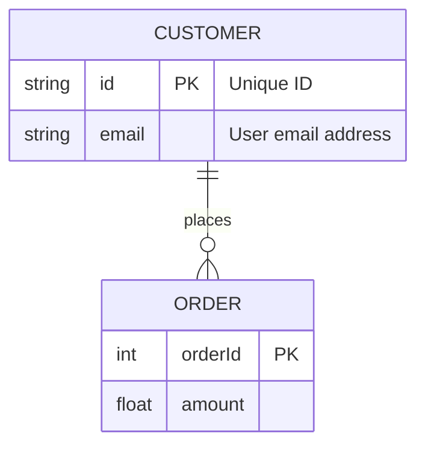
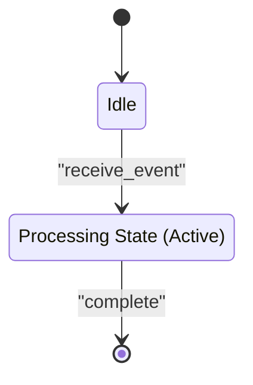

# Generating Mermaid Diagrams

Enforce clean, robust, and compile-safe Mermaid.js diagram generation to prevent parser crashes and rendering failures.

## 1. Critical Syntax Guardrails (Anti-Crash Rules)

To prevent parsing errors like `Expecting ..., got 'PS'`, strictly adhere to these literal escaping rules:

### A. The Double-Quote Rule (Edge & Node Labels)
*   **Edge Labels:** Any link label containing parentheses `()`, brackets `[]`, braces `{}`, slashes `/`, commas `,`, colons `:`, or semi-colons `;` **must** be wrapped in double quotes.
    *   ❌ *Wrong:* `A -->|4. Tool Call (Function)| B`
    *   *Right:* `A -->|"4. Tool Call (Function)"| B`
*   **Node Labels:** Any node display text containing special characters or punctuation must be enclosed in double quotes inside its shape delimiters.
    *   ❌ *Wrong:* `A(Fetch Data (v1))`
    *   *Right:* `A("Fetch Data (v1)")` or `A["Fetch Data (v1)"]`
*   **Nested Quotes:** Escape inner quotes using backslashes:
    *   `A("User says \"Hello\"")`

### B. Node ID Constraints
*   Node IDs (the unique keys pointing to nodes) must be simple alphanumeric strings without spaces, hyphens, or special characters. Separating the ID from the display label is the safest pattern.
    *   ❌ *Wrong:* `auth-service-v2[Auth Service]`
    *   *Right:* `authServiceV2["Auth Service"]`

---

## 2. Diagram-Specific Implementation Standards

### Flowcharts (`flowchart`)
*   Always use `flowchart` instead of the legacy `graph` keyword (supports better rendering engines).
*   Specify a clean layout direction: `TD` (Top-Down) or `LR` (Left-to-Right).
*   Explicitly close all `subgraph` blocks with `end`.



### Sequence Diagrams (`sequenceDiagram`)
*   **Never** use flowchart arrows (like `-->`) in sequence diagrams. 
*   Only use sequence-specific arrow types:
    *   `->>` (Solid line, solid arrowhead - Synchronous call)
    *   `-->>` (Dotted line, solid arrowhead - Reply message)
    *   `->` (Solid line, no arrowhead)
    *   `-->` (Dotted line, no arrowhead)
    *   `-x` / `--x` (Async messages)
*   Use `Note over`, `Note left of`, or `Note right of` for annotations.



### Entity Relationship Diagrams (`erDiagram`)
*   Define entity schemas within `{}`.
*   Format attributes as: `type name key "comment"`
*   Always quote relationship descriptions: `ENTITY1 ||--|{ ENTITY2 : "places"`



### State Diagrams (`stateDiagram-v2`)
*   Always use `stateDiagram-v2` for modern rendering.
*   Define transition descriptions using double quotes: `State1 --> State2 : "Action Triggered"`.
*   Use `state "Long State Name" as stateId` to represent complex states cleanly.



---

## 3. Visual & Style Guidelines

1.  **Keep Layouts Simple:** Avoid dense cyclical linkages. If a diagram gets over 30 nodes, split it into multiple focused subgraphs or separate diagrams.
2.  **Autonumbering:** Always include `autonumber` in sequence diagrams to improve flow readability.
3.  **Theming:** Stick to standard themes or use basic styling directive syntax if requested, avoiding complex CSS style definitions that fail across different viewer renderers (like GitHub vs. Obsidian).
4.  **Color Contrast:** When defining custom background fill colors inside class styles (`classDef`), always specify an explicit high-contrast text color (such as `color:#000` for light backgrounds) because standard markdown rendering engines default node text to white/light-grey in dark mode, creating unreadable low-contrast nodes.
5.  **Status Color Coding:** When depicting lifecycle stages, status, or progress in Mermaid diagrams, use clear, standardized color coding (for example, soft blue for merged/released, soft green for completed but pending stack/active development, and white for planned/backlog items) to improve readability and status scanning.

---

## 4. Optional Syntax Validation Script

An optional syntax validation and linting script is provided in the `scripts/` directory to help verify any Mermaid diagrams prior to rendering.

### Usage
Run the Python script against a Markdown or raw Mermaid file:
```bash
python3 skills/documentation/generating-mermaid-diagrams/scripts/validate_mermaid.py path/to/your/document.md
```

This will automatically find and lint all ` ```mermaid ` blocks in the file, identifying unquoted special characters, mismatched subgraphs, flowchart arrows in sequence diagrams, and unquoted ER/state relationships.

